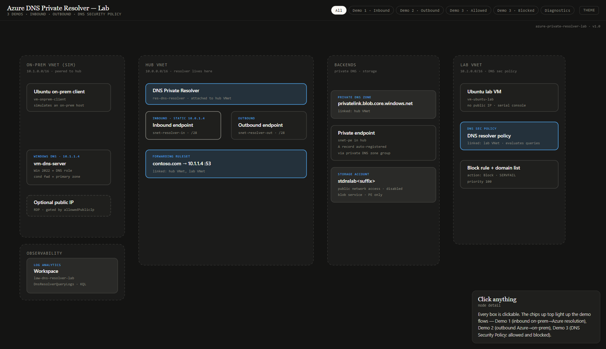
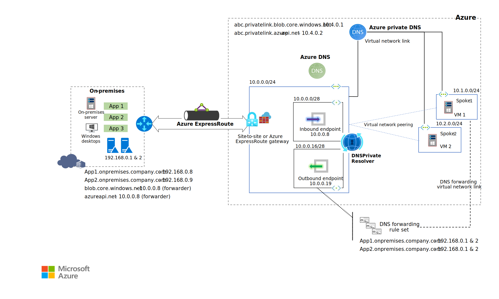
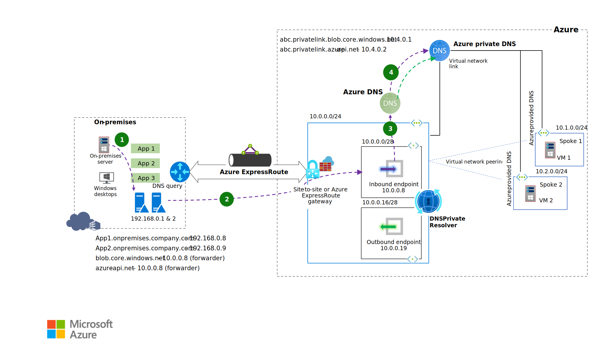
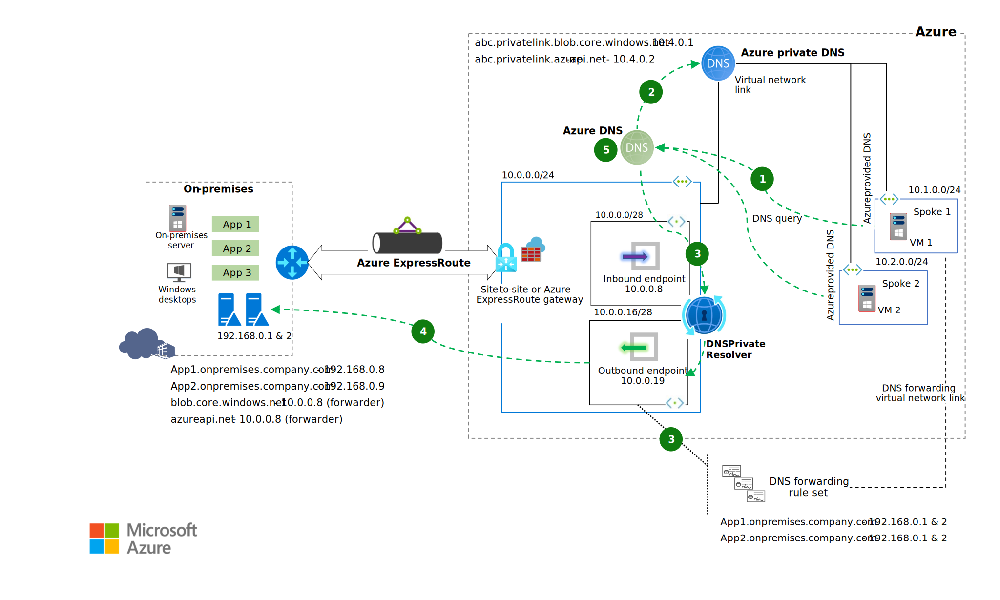

# Azure DNS Private Resolver Lab

A reproducible lab that demonstrates **Azure DNS Private Resolver** end-to-end
across three demos: on-premises -> Azure DNS resolution via an inbound
endpoint, Azure -> on-premises resolution via an outbound endpoint and
forwarding ruleset, and the **DNS Security Policy** feature that blocks
queries against a domain list.

It runs entirely from **GitHub Codespaces** with no local prerequisites.
Infrastructure is **Bicep + Azure Verified Modules**. Deployment is via an
**OIDC-secured GitHub Actions pipeline** with a `what-if` gate, or via a
single `az deployment sub create` from your Codespace terminal.



> The PNG above is a snapshot of the lab's interactive HTML diagram. For the
> clickable version with per-demo flow highlights and per-resource detail
> cards, **[open the interactive diagram](https://samsmith-msft.github.io/azure-private-resolver-lab/diagram/architecture.html)**
> (served via GitHub Pages) — or download
> [`diagram/architecture.html`](diagram/architecture.html) and open it
> locally.

## Contents

- [What this lab deploys](#what-this-lab-deploys)
- [Reference architecture](#reference-architecture)
- [Prerequisites](#prerequisites)
- [Run in GitHub Codespaces](#run-in-github-codespaces)
- [Run locally with the Azure CLI](#run-locally-with-the-azure-cli)
- [Configuration parameters](#configuration-parameters)
- [Demo 1 — Inbound: on-prem resolves an Azure private endpoint](#demo-1--inbound-on-prem-resolves-an-azure-private-endpoint)
- [Demo 2 — Outbound: an Azure VM resolves an on-prem zone](#demo-2--outbound-an-azure-vm-resolves-an-on-prem-zone)
- [Demo 3 — DNS Security Policy](#demo-3--dns-security-policy)
- [Authenticate to the lab VMs](#authenticate-to-the-lab-vms)
- [GitHub Actions pipeline (OIDC) — one-time setup](#github-actions-pipeline-oidc--one-time-setup)
- [Teardown](#teardown)
- [Troubleshooting](#troubleshooting)
- [Repository layout](#repository-layout)
- [License and attribution](#license-and-attribution)

## What this lab deploys

Three VNets in a single resource group (default: `rg-dnslab`, region
`eastus2`):

- **Hub VNet** (`10.0.0.0/16`) — DNS Private Resolver, inbound endpoint with a
  pinned static IP (`10.0.1.4`), outbound endpoint, forwarding ruleset, the
  `privatelink.blob.core.windows.net` private DNS zone, a storage account
  with public access disabled, and its private endpoint.
- **On-prem VNet** (`10.1.0.0/16`, peered to hub) — Windows Server 2022 with
  the DNS Server role at `10.1.1.4`, plus an Ubuntu client. The Windows DNS
  server has a conditional forwarder for `privatelink.blob.core.windows.net`
  pointing at the resolver inbound endpoint, and a primary zone for the
  on-prem domain (default `contoso.com`) with a single A record (default
  `dns` -> `10.1.1.4`).
- **Lab VNet** (`10.2.0.0/16`) — Ubuntu lab VM. The DNS Security Policy is
  linked to this VNet so its queries are evaluated against the policy's
  block list.
- **Log Analytics workspace** for DNS Security Policy diagnostic logs.

## Reference architecture

This lab is grounded in the canonical Microsoft reference architecture for
Azure DNS Private Resolver. The lab simplifies hybrid connectivity by using
VNet peering instead of ExpressRoute or VPN.



*Image: Microsoft Learn — [Azure DNS Private Resolver architecture](https://learn.microsoft.com/azure/architecture/networking/architecture/azure-dns-private-resolver). Licensed under [Creative Commons CC BY 4.0](https://creativecommons.org/licenses/by/4.0/).*

## Prerequisites

**Codespaces:** none. Click the green **Code** button -> **Codespaces** ->
**Create codespace on main**. The dev container preinstalls the Azure CLI
(with Bicep), GitHub CLI, and PowerShell.

**Local:** an Azure CLI 2.55+ install with `az bicep` available, plus a bash
shell. (On Windows, prefer WSL2.) `gh` is optional but useful.

You will also need:

- An **Azure subscription** where you can deploy networking + compute and
  create role assignments (for the pipeline path; the local-CLI path needs
  only deploy permissions).
- **A strong password (12+ characters)** for the lab VMs. You will set this
  as the `ADMIN_PASSWORD` environment variable. It is never committed.

## Run in GitHub Codespaces

1. Open a Codespace from this repository (Code -> Codespaces -> Create).
2. **Open a bash terminal** (View -> Terminal). The dev container pins bash
   as the default; if your VS Code settings sync overrides this, run `bash`
   first.
3. Sign in to Azure interactively:
   ```bash
   az login --use-device-code
   az account set --subscription "<your-subscription-id>"
   ```
4. Set a strong VM password (this stays in the Codespace; it is NOT pushed
   to git):
   ```bash
   read -s -p "Admin password: " ADMIN_PASSWORD; echo
   export ADMIN_PASSWORD
   ```
5. Deploy:
   ```bash
   az deployment sub create \
     --location eastus2 \
     --template-file infra/main.bicep \
     --parameters infra/main.bicepparam \
     --parameters adminPassword="$ADMIN_PASSWORD" \
     --name dns-resolver-lab
   ```
   The deployment takes about 12-15 minutes. Note the outputs at the end —
   they include the storage account name and the inbound endpoint IP you
   will need for the demos.

## Run locally with the Azure CLI

The same flow works on your workstation. From the repository root in a bash
shell:

```bash
az login
az account set --subscription "<your-subscription-id>"

read -s -p "Admin password: " ADMIN_PASSWORD; echo
export ADMIN_PASSWORD

az deployment sub create \
  --location eastus2 \
  --template-file infra/main.bicep \
  --parameters infra/main.bicepparam \
  --parameters adminPassword="$ADMIN_PASSWORD" \
  --name dns-resolver-lab
```

> **Windows PowerShell variant** (if you prefer not to use WSL):
> ```powershell
> az login
> az account set --subscription "<your-subscription-id>"
> $pw = Read-Host -Prompt 'Admin password' -AsSecureString
> $env:ADMIN_PASSWORD = [Runtime.InteropServices.Marshal]::PtrToStringAuto(
>   [Runtime.InteropServices.Marshal]::SecureStringToBSTR($pw))
> az deployment sub create `
>   --location eastus2 `
>   --template-file infra/main.bicep `
>   --parameters infra/main.bicepparam `
>   --parameters adminPassword=$env:ADMIN_PASSWORD `
>   --name dns-resolver-lab
> ```

## Configuration parameters

Set these in `infra/main.bicepparam` or override on the command line with
`--parameters key=value`.

| Parameter | Default | Purpose |
|---|---|---|
| `location` | `eastus2` | Region for every resource. |
| `prefix` | `dnslab` | Lowercase prefix used in resource names. 3-10 chars. |
| `resourceGroupName` | `rg-dnslab` | Resource group created at deploy time. |
| `adminUsername` | `azureuser` | Admin login for all VMs. |
| `adminPassword` | *(required)* | Secure parameter. Pass at deploy time. |
| `onpremDnsDomain` | `contoso.com` | On-prem zone hosted on the Windows DNS server (Demo 2). |
| `onpremDnsRecordName` | `dns` | A record name in the on-prem zone (resolves to `10.1.1.4`). |
| `blockedDomains` | `[malicious.contoso.com., exploit.adatum.com.]` | DNS Security Policy block list. Each FQDN must end with `.` |
| `allowedPublicIp` | `''` (empty) | Set to your public IPv4 to enable RDP/3389 to the Windows DNS server from that IP only. Empty -> serial console only. |
| `tags` | `{workload: dns-resolver-lab, env: lab}` | Applied to every resource. |

## Demo 1 — Inbound: on-prem resolves an Azure private endpoint



*Image: Microsoft Learn — [Azure DNS Private Resolver — on-premises query traffic](https://learn.microsoft.com/azure/architecture/networking/architecture/azure-dns-private-resolver). Licensed under [Creative Commons CC BY 4.0](https://creativecommons.org/licenses/by/4.0/).*

**What it shows:** an on-prem client resolving the storage account's
`*.blob.core.windows.net` hostname returns the **private endpoint IP**, not
the public storage VIP. Path: client -> Windows DNS (10.1.1.4) -> conditional
forwarder -> peering -> resolver inbound endpoint (10.0.1.4) -> privatelink
zone -> private endpoint A record.

**Run it:**

1. Capture the storage account hostname from the deployment outputs:
   ```bash
   STORAGE_HOST=$(az deployment sub show --name dns-resolver-lab \
     --query "properties.outputs.storageAccountBlobHost.value" -o tsv)
   echo "$STORAGE_HOST"
   ```
2. Open the Azure portal -> Virtual machines -> `vm-dnslab-onprem-client` ->
   **Serial console**. Log in with `azureuser` and the password you supplied.
3. From the on-prem client, resolve the hostname:
   ```bash
   nslookup <storage-host>
   ```
4. **Expected:** an A record in `10.0.3.x` (the private endpoint subnet),
   not a public storage IP.

## Demo 2 — Outbound: an Azure VM resolves an on-prem zone



*Image: Microsoft Learn — [Azure DNS Private Resolver — spoke query traffic](https://learn.microsoft.com/azure/architecture/networking/architecture/azure-dns-private-resolver). Licensed under [Creative Commons CC BY 4.0](https://creativecommons.org/licenses/by/4.0/).*

**What it shows:** an Azure VM resolving an on-prem-only zone returns the
correct A record from the on-prem Windows DNS server. Path: lab VM -> Azure
DNS -> forwarding ruleset (linked to lab VNet) -> outbound endpoint -> on-prem
Windows DNS at 10.1.1.4 -> A record for `dns.contoso.com`.

**Run it:**

1. Open the Azure portal -> Virtual machines -> `vm-dnslab-ubuntu-lab` ->
   **Serial console**. Log in with `azureuser` and your password.
2. Resolve the on-prem record:
   ```bash
   dig +short dns.contoso.com
   ```
3. **Expected:** `10.1.1.4`. If you changed `onpremDnsDomain` or
   `onpremDnsRecordName`, adjust the FQDN accordingly
   (`<onpremDnsRecordName>.<onpremDnsDomain>`).

## Demo 3 — DNS Security Policy

**What it shows:** a DNS Security Policy linked to the lab VNet evaluates
every DNS query the lab VM makes. Queries matching the block list return
`SERVFAIL`; everything else passes through. All decisions are logged to Log
Analytics.

**Run it (from `vm-dnslab-ubuntu-lab` serial console):**

```bash
# Allowed query — resolves normally
dig +short microsoft.com

# Blocked query — returns SERVFAIL
dig malicious.contoso.com
dig exploit.adatum.com
```

**Inspect the logs in Log Analytics:**

```bash
WORKSPACE_ID=$(az monitor log-analytics workspace show \
  --resource-group rg-dnslab --workspace-name law-dnslab \
  --query customerId -o tsv)

az monitor log-analytics query \
  --workspace "$WORKSPACE_ID" \
  --analytics-query "DnsResolverQueryLogs | where DnsResponseCode == 'SERVFAIL' | take 20" \
  --output table
```

> **Switch the block response.** Edit
> `infra/modules/dns-security-policy.bicep` and change `blockResponseCode`
> from `SERVFAIL` to `NXDOMAIN`. Redeploy. Now blocked queries return the
> synthetic domain `blockpolicy.azuredns.invalid` instead of failing.

## Authenticate to the lab VMs

| VM | Reach it via | Username | Password |
|---|---|---|---|
| `vm-dnslab-onprem-client` | Serial console | `azureuser` (or your `adminUsername`) | the value you supplied via `ADMIN_PASSWORD` |
| `vm-dnslab-ubuntu-lab` | Serial console | `azureuser` | same |
| `vm-dnslab-dns` (Windows DNS) | Serial console — or RDP if `allowedPublicIp` is set | `azureuser` | same |

The admin username is also exposed as a deployment output (`adminUsername`).
The password is **never** stored in the deployment, the repo, or the
pipeline state — it is only ever held in your terminal session and the VM
itself.

To enable RDP to the Windows DNS server, redeploy with
`--parameters allowedPublicIp='<your-public-ipv4>'`. An NSG rule will allow
TCP/3389 from that single IP only.

## GitHub Actions pipeline (OIDC) — one-time setup

The included workflow at `.github/workflows/deploy.yml` runs `what-if` on
every PR that touches `infra/**` and deploys on push to `main`, gated by the
`production` GitHub environment's required reviewer. Authentication is OIDC
via a User-Assigned Managed Identity (UAMI) — **no service principal
secrets** are stored in the repo.

To enable the pipeline, run this once from your local terminal (not from a
Codespace) where you have permission to create UAMIs and role assignments:

```bash
# Variables
SUB_ID="<your-subscription-id>"
TENANT_ID="<your-tenant-id>"
LOCATION="eastus2"
RG_UAMI="rg-dnslab-cicd"
UAMI_NAME="uami-dnslab-deploy"
GH_OWNER="<your-github-owner>"
GH_REPO="<your-github-repo>"

# 1. Create a separate RG for the UAMI (so it survives lab teardowns)
az group create --name "$RG_UAMI" --location "$LOCATION"

# 2. Create the UAMI
az identity create --name "$UAMI_NAME" --resource-group "$RG_UAMI" --location "$LOCATION"
UAMI_CLIENT_ID=$(az identity show --name "$UAMI_NAME" --resource-group "$RG_UAMI" --query clientId -o tsv)
UAMI_PRINCIPAL_ID=$(az identity show --name "$UAMI_NAME" --resource-group "$RG_UAMI" --query principalId -o tsv)

# 3. Federated credentials for PR (what-if) and main (deploy)
cat > /tmp/fed-pr.json <<EOF
{
  "name": "${GH_REPO}-pr",
  "issuer": "https://token.actions.githubusercontent.com",
  "subject": "repo:${GH_OWNER}/${GH_REPO}:pull_request",
  "audiences": ["api://AzureADTokenExchange"]
}
EOF

cat > /tmp/fed-main.json <<EOF
{
  "name": "${GH_REPO}-main",
  "issuer": "https://token.actions.githubusercontent.com",
  "subject": "repo:${GH_OWNER}/${GH_REPO}:ref:refs/heads/main",
  "audiences": ["api://AzureADTokenExchange"]
}
EOF

cat > /tmp/fed-prod.json <<EOF
{
  "name": "${GH_REPO}-env-production",
  "issuer": "https://token.actions.githubusercontent.com",
  "subject": "repo:${GH_OWNER}/${GH_REPO}:environment:production",
  "audiences": ["api://AzureADTokenExchange"]
}
EOF

az identity federated-credential create --identity-name "$UAMI_NAME" --resource-group "$RG_UAMI" --parameters /tmp/fed-pr.json
az identity federated-credential create --identity-name "$UAMI_NAME" --resource-group "$RG_UAMI" --parameters /tmp/fed-main.json
az identity federated-credential create --identity-name "$UAMI_NAME" --resource-group "$RG_UAMI" --parameters /tmp/fed-prod.json

# 4. Grant the UAMI the role it needs at subscription scope (Contributor + User Access Administrator)
#    The lab needs both because storage + DNS resources don't require RBAC writes,
#    but enabling DNS Security Policy diagnostics may.
az role assignment create --assignee "$UAMI_PRINCIPAL_ID" --role "Contributor" --scope "/subscriptions/$SUB_ID"
az role assignment create --assignee "$UAMI_PRINCIPAL_ID" --role "User Access Administrator" --scope "/subscriptions/$SUB_ID"

# 5. Set GitHub variables (NOT secrets) for the workflow
gh variable set AZURE_CLIENT_ID --body "$UAMI_CLIENT_ID" --repo "$GH_OWNER/$GH_REPO"
gh variable set AZURE_TENANT_ID --body "$TENANT_ID" --repo "$GH_OWNER/$GH_REPO"
gh variable set AZURE_SUBSCRIPTION_ID --body "$SUB_ID" --repo "$GH_OWNER/$GH_REPO"
gh variable set AZURE_LOCATION --body "$LOCATION" --repo "$GH_OWNER/$GH_REPO"

# 6. Set the only secret — the VM admin password
gh secret set ADMIN_PASSWORD --repo "$GH_OWNER/$GH_REPO"

# 7. Create the production environment with you as a required reviewer (UI step)
echo "Now go to: https://github.com/${GH_OWNER}/${GH_REPO}/settings/environments/new"
echo "Create environment 'production' and add yourself as a required reviewer."
```

After this one-time setup, every PR that touches `infra/**` will run
`what-if` automatically. Merging to `main` triggers the deploy job, which
waits for your approval in the `production` environment before applying.

## Teardown

```bash
./teardown/teardown.sh rg-dnslab
```

Or directly: `az group delete --name rg-dnslab --yes --no-wait`.

To remove the pipeline UAMI as well, delete `rg-dnslab-cicd`.

## Troubleshooting

**Demo 2 returns NXDOMAIN.** The forwarding ruleset must be linked to the
VNet that issued the query. The lab links the ruleset to both the hub VNet
and the lab VNet. If you added another VNet, link it too.

**Demo 1 returns the public storage IP.** The on-prem client must use the
Windows DNS server (10.1.1.4) as its resolver, and the Windows DNS server
must have the conditional forwarder for `privatelink.blob.core.windows.net`
pointing at the inbound endpoint (10.0.1.4). The Custom Script Extension
configures both at deploy time. If the CSE failed, redeploy or run the
script manually from the VM.

**`Demo 3` block isn't taking effect.** The DNS Security Policy resource is
**region-scoped**. The policy and the VNet it's linked to must be in the
same region. The lab puts everything in one region by default, so this
shouldn't bite you unless you customize.

**Wait before testing immediately after deployment.** ARM returning
`Succeeded` means the control plane is done. The DNS resolver, forwarding
ruleset, and DNS Security Policy data planes can take a few minutes more to
propagate. If a query fails in the first 1-2 minutes after `az deployment
sub create` returns, wait and retry — don't conclude the lab is broken.

**Codespaces opened in PowerShell instead of bash.** Open a bash shell with
`bash`, or switch your VS Code default in the Codespace
(`terminal.integrated.defaultProfile.linux: "bash"`). The dev container
already pins this, but synced personal settings can override it.

## Repository layout

```
.
├── README.md                   # this file
├── LICENSE                     # MIT
├── .gitignore
├── .devcontainer/
│   └── devcontainer.json       # bash default; az + bicep + gh + pwsh preinstalled
├── .github/
│   └── workflows/
│       └── deploy.yml          # OIDC pipeline: PR -> what-if; main -> apply (env-gated)
├── infra/
│   ├── main.bicep              # subscription-scoped: creates RG + composes modules
│   ├── main.bicepparam         # default lab parameters
│   ├── modules/
│   │   ├── networking.bicep                # 3 VNets + peering + NSGs
│   │   ├── private-resolver.bicep          # resolver + endpoints + ruleset + rule
│   │   ├── private-endpoint-storage.bicep  # storage + PE + privatelink zone
│   │   ├── on-prem-sim.bicep               # Win DNS + Ubuntu client + CSE
│   │   ├── lab-vm.bicep                    # Ubuntu lab VM (Demo 3)
│   │   └── dns-security-policy.bicep       # raw resources (no AVM coverage)
│   └── scripts/
│       ├── Configure-WindowsDns.ps1        # CSE payload
│       └── README.md
├── diagram/
│   ├── architecture.html       # interactive HTML diagram (full screen, dark default)
│   └── architecture.png        # exported snapshot for README embedding
├── images/                     # canonical reference imagery from learn.microsoft.com
│   ├── reference-architecture.svg
│   ├── inbound-traffic-flow.svg
│   ├── outbound-traffic-flow.svg
│   └── README.md
├── tests/
│   └── validate-lab.sh         # dig/nslookup helpers for each demo
└── teardown/
    └── teardown.sh             # az group delete
```

## License and attribution

This lab is licensed under the [MIT License](LICENSE).

Reference imagery in `images/` is sourced from official Microsoft Learn
documentation under [Creative Commons CC BY 4.0](https://creativecommons.org/licenses/by/4.0/).
Each image is captioned in the README with a link back to its source page.
See [`images/README.md`](images/README.md) for the full attribution list.

The architecture is grounded in the Microsoft Learn reference scenario for
[Azure DNS Private Resolver](https://learn.microsoft.com/azure/architecture/networking/architecture/azure-dns-private-resolver),
the [hybrid DNS resolution how-to](https://learn.microsoft.com/azure/dns/private-resolver-hybrid-dns),
and the [DNS Security Policy overview](https://learn.microsoft.com/azure/dns/dns-security-policy).
